#### ✨Flex

*  **display 속성**
* **하나의 축**으로 구성되어 있음
* **Grid로 페이지의 골격**을 잡고 **내부의 요소는 Flex**로 정렬하면 편함
  * Grid는 실무에서 아직까지 많이 사용하지 않음
* Flex테스트하기!
  * **부모요소**가 있어야되고, 그 안에 자식들이 있어야 됨
    * `display: flex;` `justify-content`, `align-items`은 **부모요소에 적용**
    * 원래 content요소 만큼 높이가 설정되어 있는데 `display:flex`를 적용하면 **높이가 자동으로 늘어남!** (**height**가 **contatiner(부모요소)만큼** 늘어남!)
  * `flex-direction`
    * 기본값: `row`
    * `flex-direction`을 통해 축을 설정할 수 있음
      * `column-reverse`, `row-reverse` 도 가능!


| `display: flex ` 적용X                                       | `display: flex` 적용                                         |
| ------------------------------------------------------------ | ------------------------------------------------------------ |
| 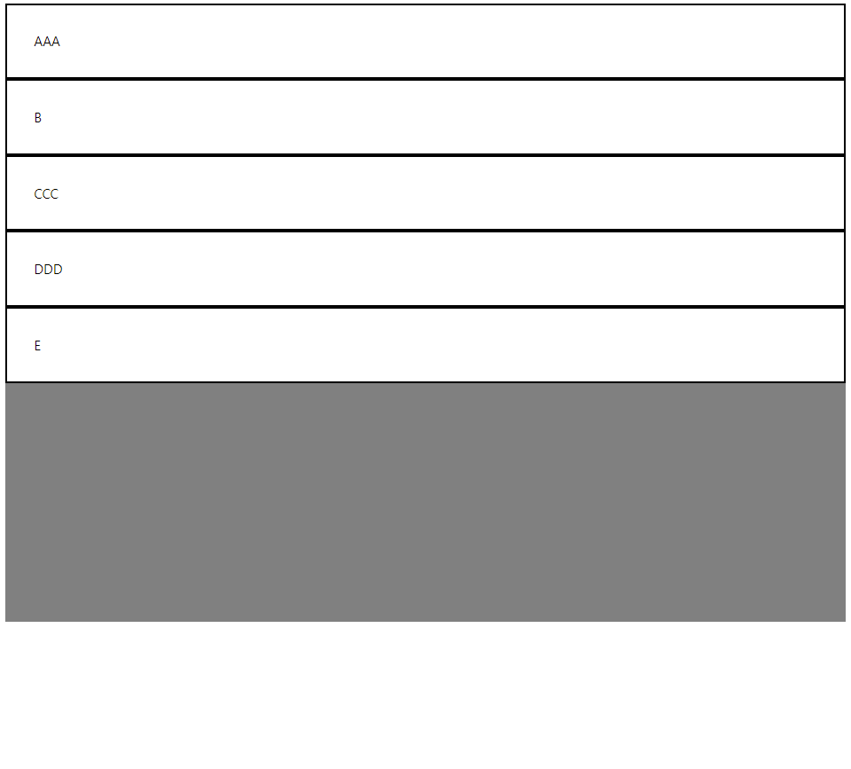<br />`flex-direction: column`의 형태 | 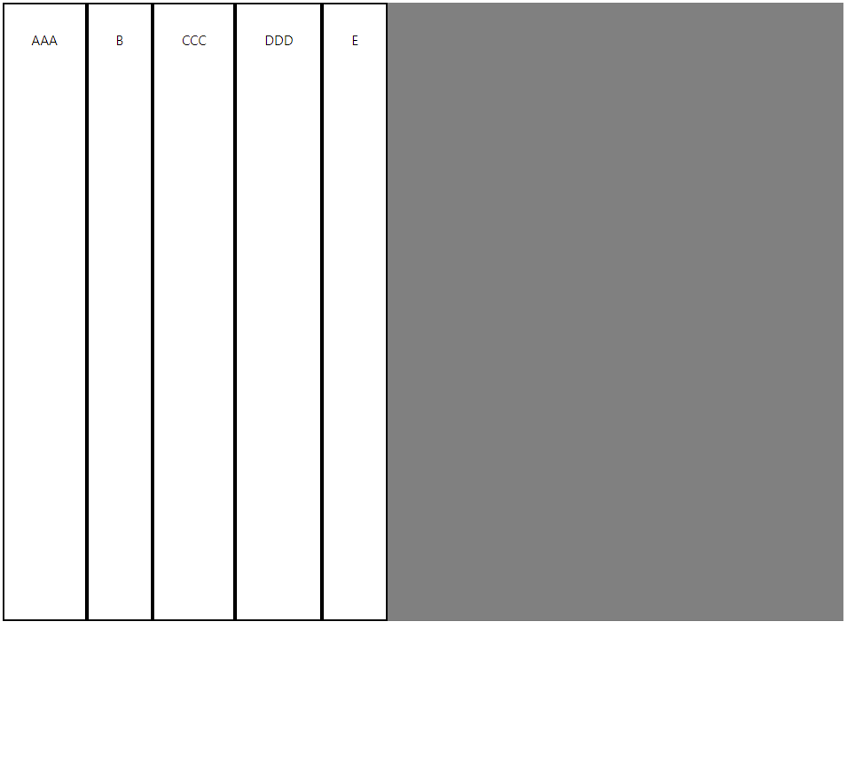<br />`flex-direction: row`의 형태 |

| `flex-direction: column-reverse`                             | `flex-direction: row-reverse`                                |
| ------------------------------------------------------------ | ------------------------------------------------------------ |
| 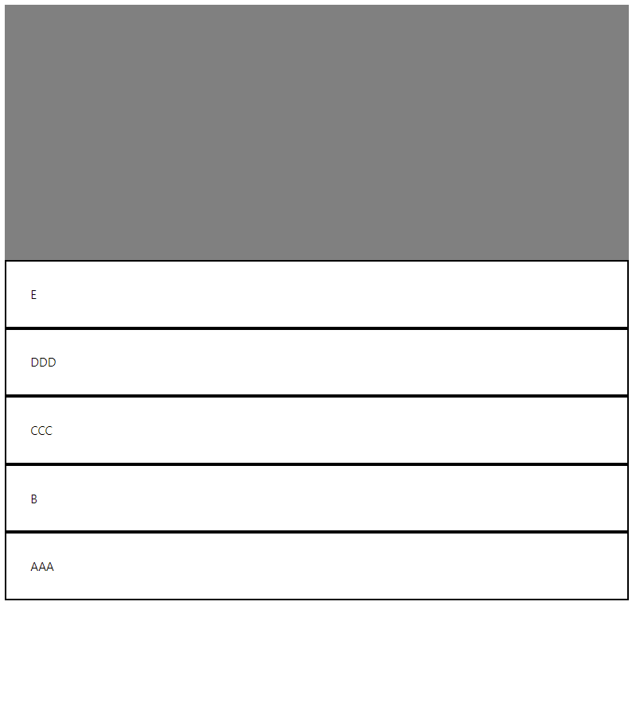 | 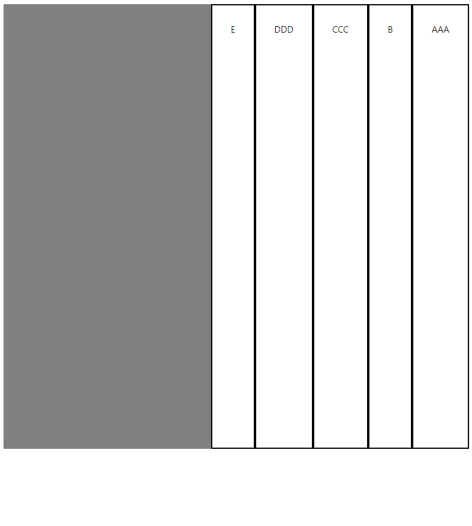 |


#### ✨정렬

* `justify-content`

  * `justify-content: flex-start`가 **기본값**
  * `justify-content: flex-end`
  * `justify-content: center`
    * 가운데 정렬
  * `justify-content: space-between`
    * 균일한 간격으로 정렬
  * `justify-content: space-around`
    * 양 끝 여백까지 균일하게 정렬

  | `justify-content: flex-start`                                | `justify-content: flex-end`                                  |
  | ------------------------------------------------------------ | ------------------------------------------------------------ |
  | 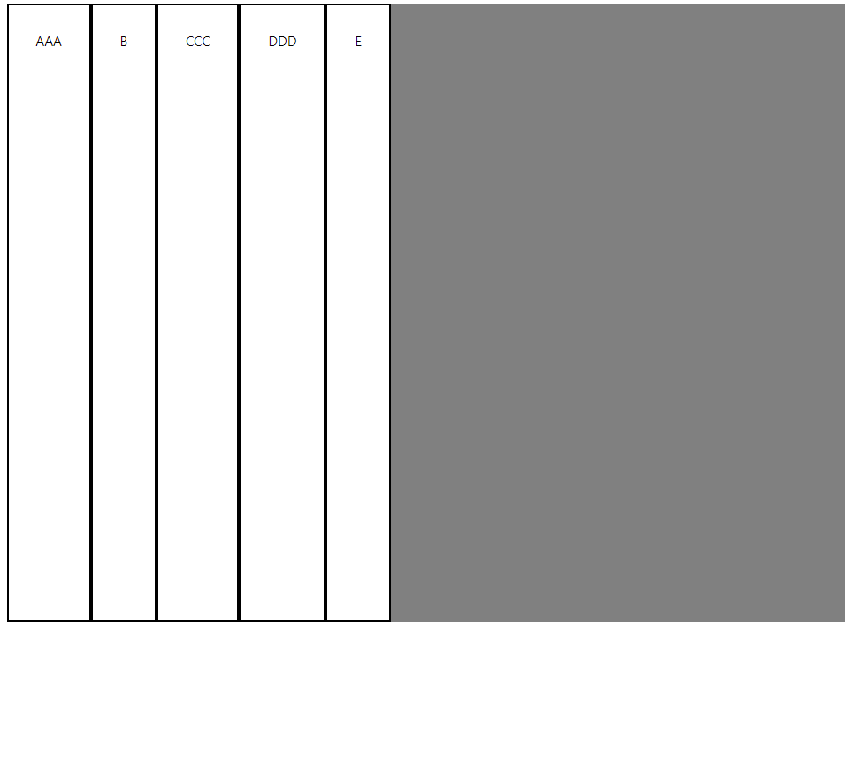 | 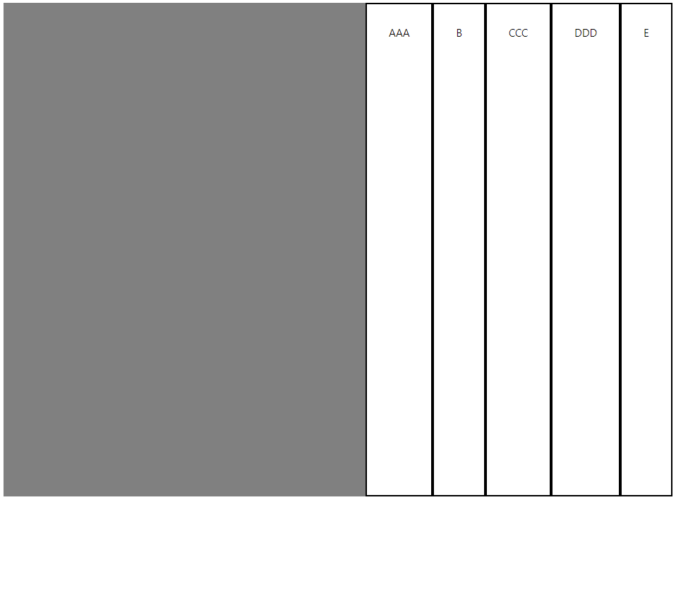 |

* `align-items`

  * `align-items: stretch`가 **기본값**
  * `align-items: flex-start`
  * `align-items: flex-center`

  | `align-items: flex-start`                                    | `align-items: flex-end`                                      |
  | ------------------------------------------------------------ | ------------------------------------------------------------ |
  | 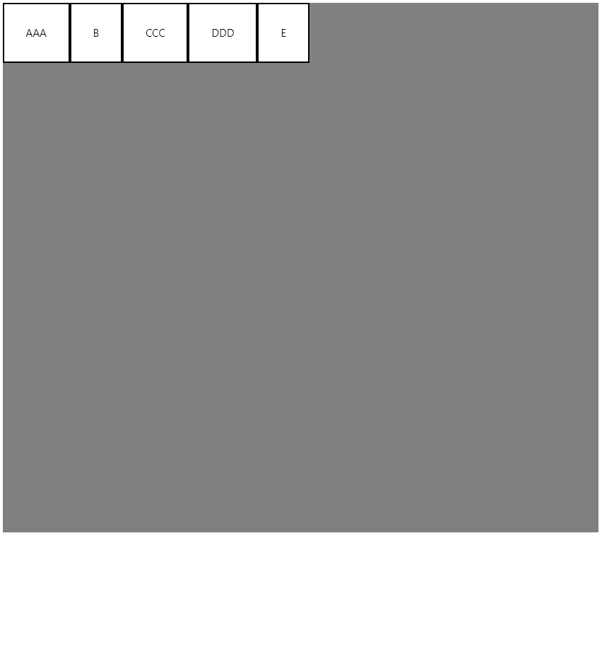 | 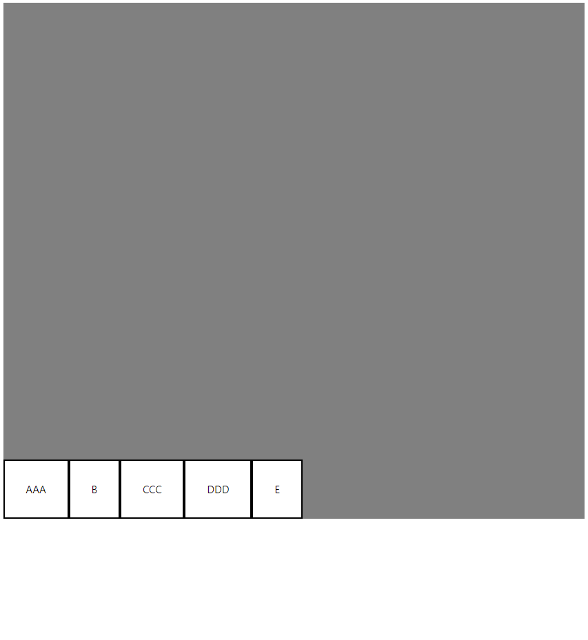 |


#### 정 중앙 정렬

* flex를 사용해서 간편하게 구현할 수 있음

```
display: flex;
justify-content: center;
align-items: center;
```


#### flex-grow

* 자식 요소에 적용

* 무슨 숫자를 놓든, 숫자가 오기만 하면 **균일한 크기**로 배치됨
  * 자신의 각 content를 제외한 **여백의 크기**가 동일한 것!!

```
.item {
    flex-grow:1;
    padding: 2em;
    border: 3px solid black;
    background: white;
}
```

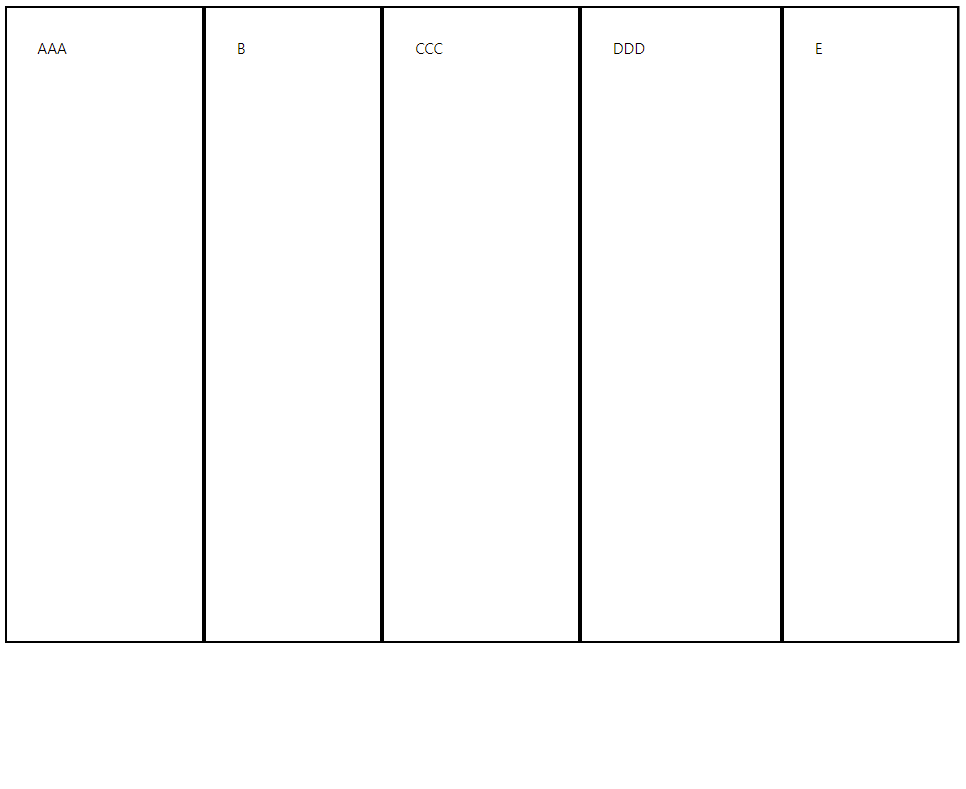

* 각 요소의 크기(여백의 크기)를 다르게 적용하기 위해서는 요소 각각에 `flex-grow`속성을 적용하면 됨

```
.item:nth-child(1) {flex-grow: 1;}
.item:nth-child(2) {flex-grow: 2;}
.item:nth-child(3) {flex-grow: 3;}
.item:nth-child(4) {flex-grow: 4;}
.item:nth-child(5) {flex-grow: 5;}
```

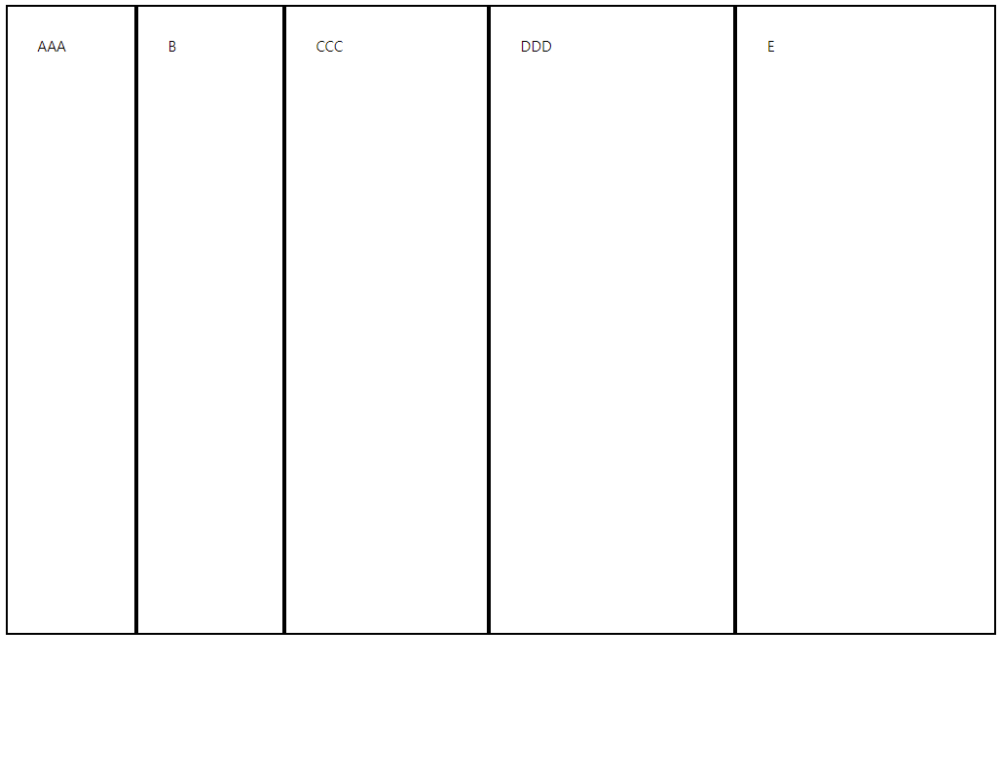

#### flex-basis

* **여백이 아닌 content 자체의 비율**을 조절하기 위해서는 `flex-basis` 추가!
* `flex-basis: auto`
  * 기본값
* `flex-basis: 0`
  * content 비율을 동일하게 할 수 있음

```
flex-grow:1;
flex-basis: 0;

위의 코드 두 줄은 아래 코드로 축약하여 나타낼 수 있음
flex: 1
```

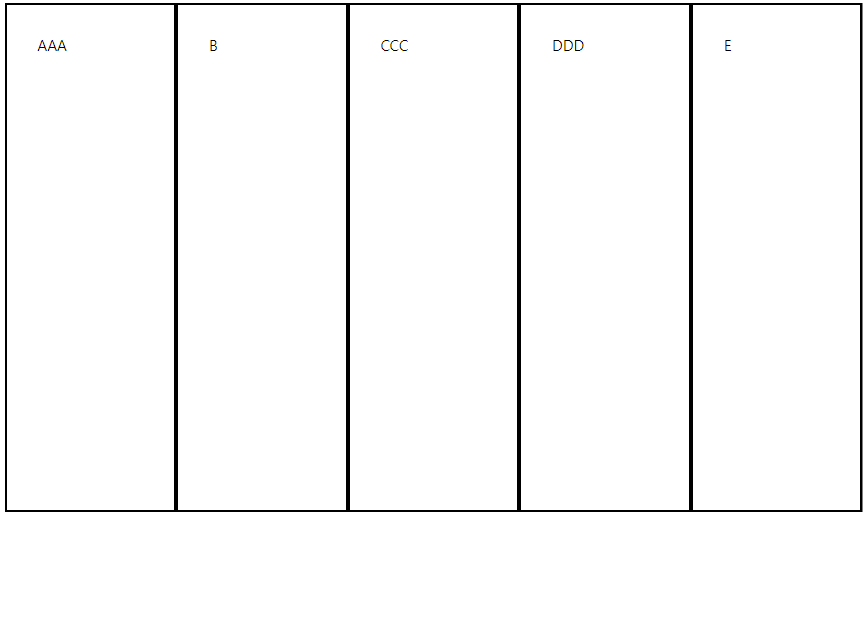

* `flex: 1`

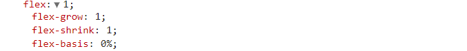